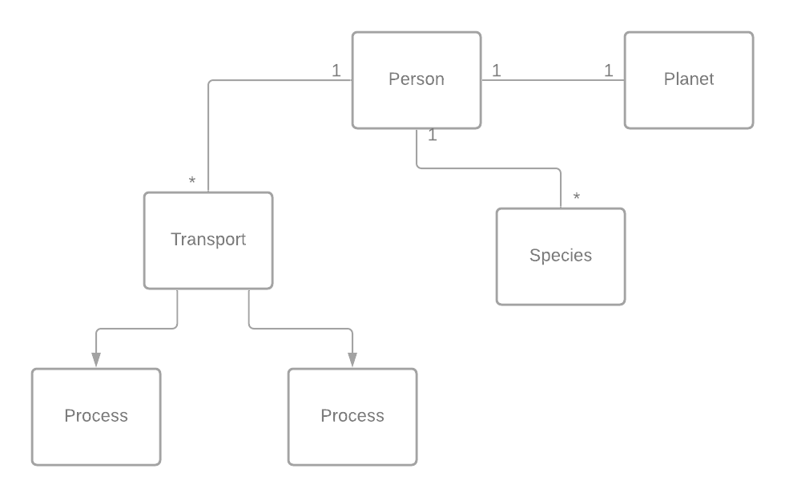
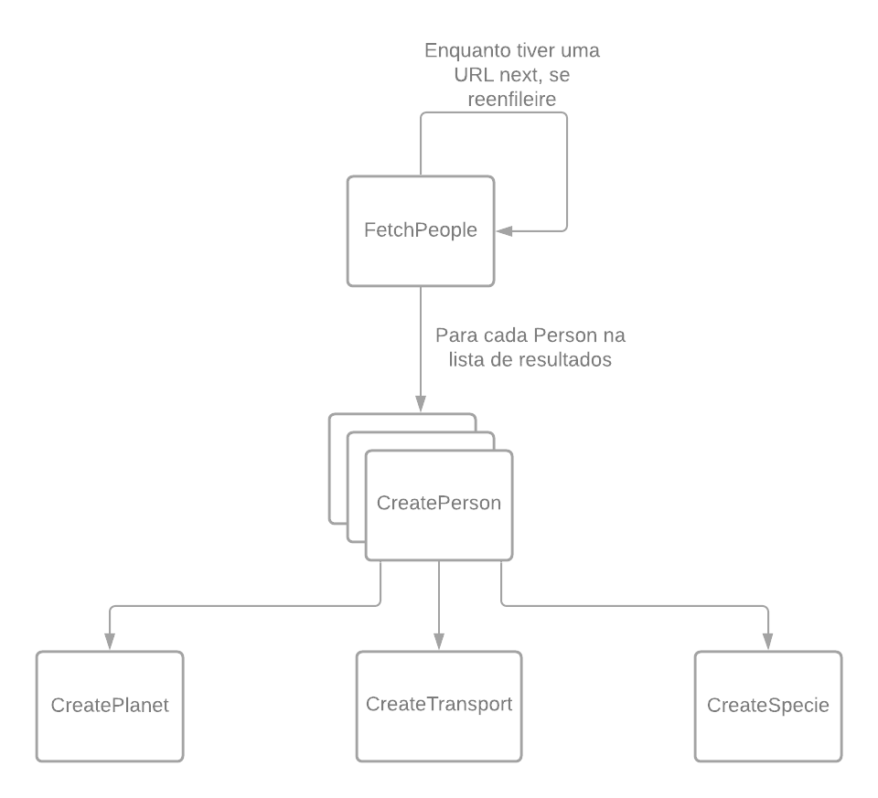
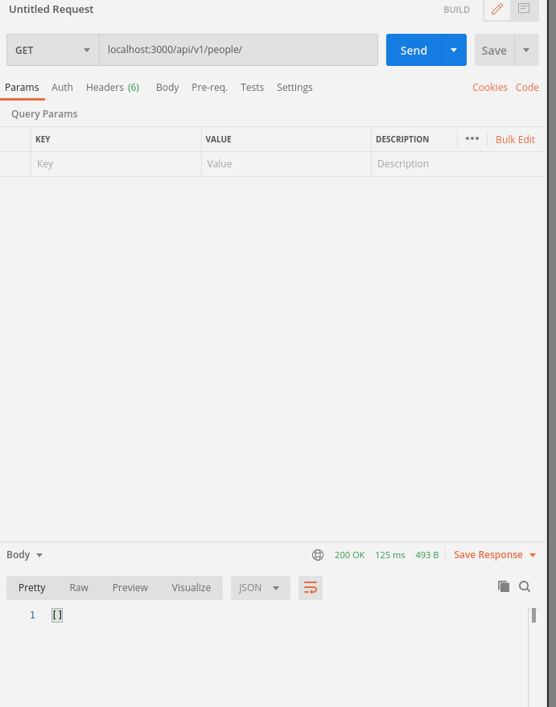
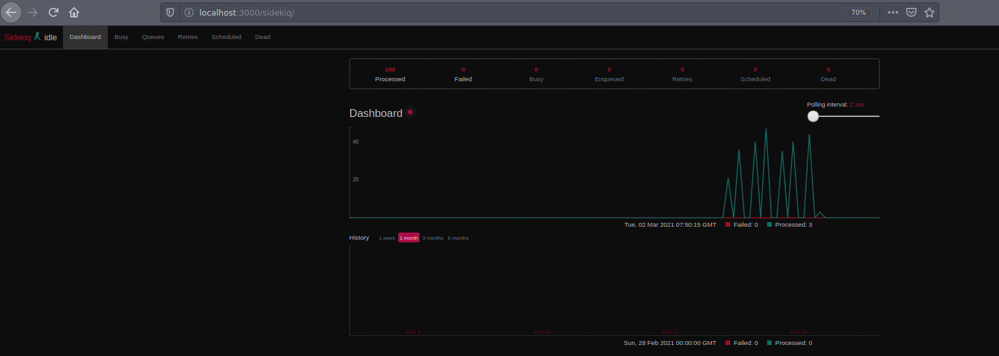
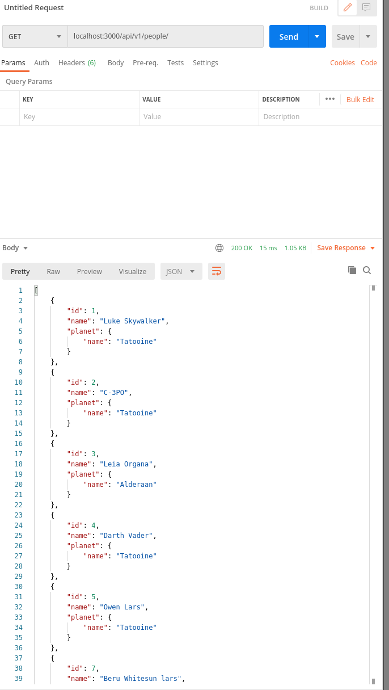
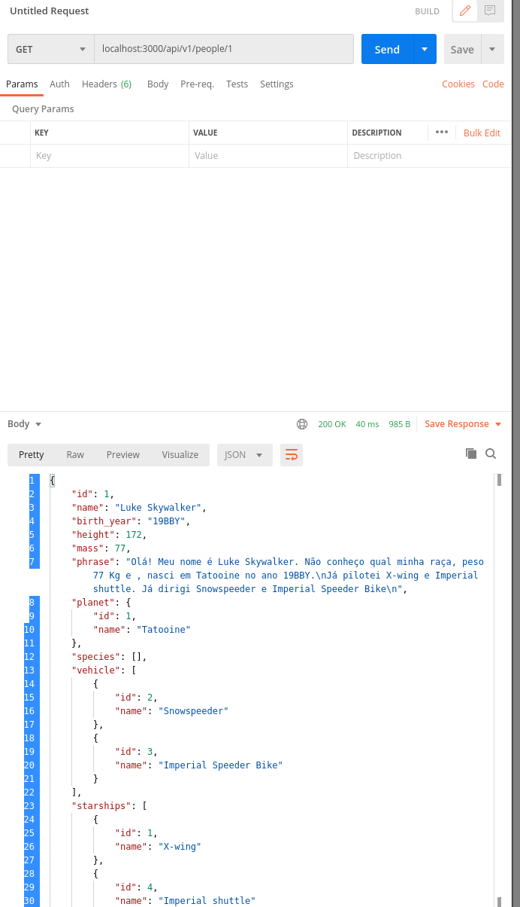
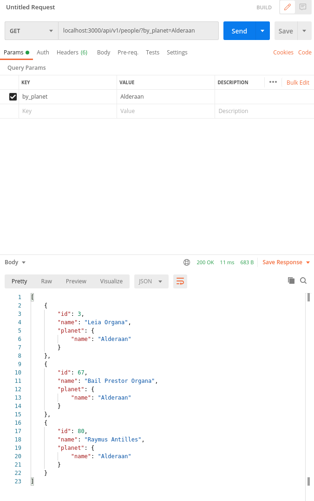

## Pulsus tech challenge

Este projeto consiste em um simples backend no qual conseguimos requisitar algumas informações básicas de personagens de star wars. Informações definidas na descrição do desafio.

### Overview de arquitetura

Como podemos ver no diagrama abaixo, o projeto tem uma arquitetura simples, que se assemelha bastante ao apresentado no Swapi. Com a diferença que, ao invés de links para outras entidades, nós temos de fato os dados.




### Arquitetura do pulling de dados

O pull de dados é feito de forma assincrona, utilizando Sidekiq Jobs, sendo assim podemos conseguir mais rapidamente ter os dados no banco. A arquitetura de enfileiramento dos jobs é feita da seguinte forma:




### Instruções para executar o projeto

Para rodar esse projeto mais rapidamente, se faz necessário a utilização do `Docker` e do `docker-compose`, de modo que facilita-se a execução. Não abordarei aqui a forma de rodá-lo diretamente no host, porém para isto vc dependerá da versão `2.7.2` do ruby, ter o postgresql e o redis instalados em sua maquina, bem como ter o bundler.
Tendo o `Docker e o `docker-compose` instalados e configurados em sua maquina, basta rodar o comando abaixo:

```
walter in ~/Workspace/pulsus_challenge/starwars_app (master ✱≠) ➜  dcc up -d
Creating network "starwars_app_default" with the default driver
Pulling db (postgres:9.6)...
9.6: Pulling from library/postgres
cae7303ade7f: Pull complete
74b1b2de3667: Pull complete
2a8214680dbf: Pull complete
2d96c85c9c8e: Pull complete
ea61da79a978: Pull complete
ad4d0ef2cddb: Pull complete
6a2c02e60b45: Pull complete
9a9993af0b23: Pull complete
a0aa14f739bb: Pull complete
a0fb6c913aa4: Pull complete
78a43b0068bb: Pull complete
da8fb3649186: Pull complete
ec5c3bb30d0d: Pull complete
45b257c393b5: Pull complete
Digest: sha256:1e1a426e885ed921a40c309048669ab3d799fea23bdde0816aec41fb980c66b8
Status: Downloaded newer image for postgres:9.6
Pulling gems (busybox:)...

```
> O comando `dcc` é uma alias para o comando docker-compose

O comando acima irá fazer pull de todas as imagens configuradas, bem como fazer build da imagem docker da aplicação que será executada tanto na API quanto no Worker. Neste momento vc pode pegar um café pq demorará um pouco :B

Após o término da execução do comando acima, vc será capaz de ver a seguinte saida:

```
Successfully built c967dcfb32e8
Successfully tagged starwars_app_app_worker:latest
WARNING: Image for service app_worker was built because it did not already exist. To rebuild this image you must use `docker-compose build` or `docker-compose up --build`.
Creating starwars_app_db_1    ... done
Creating starwars_app_gems_1  ... done
Creating starwars_app_redis_1 ... done
Creating starwars_app_app_worker_1 ... done
Creating starwars_app_app_1        ... done
```

Isso significa que os containers estão rodando em modo daemon, podemos checar rodando um comando `docker ps` (ou um `dcc ps` como preferir)

```
walter in ~/Workspace/pulsus_challenge/starwars_app (master ✱≠) ➜  docker ps
CONTAINER ID        IMAGE                     COMMAND                  CREATED             STATUS              PORTS                    NAMES
222712e55233        starwars_app_app          "bash startup_app.sh"    45 seconds ago      Up 44 seconds       0.0.0.0:3000->3000/tcp   starwars_app_app_1
41d2c4fd5690        starwars_app_app_worker   "bash startup_app_wo…"   45 seconds ago      Up 44 seconds                                starwars_app_app_worker_1
59445b021203        redis:5.0.0               "docker-entrypoint.s…"   47 seconds ago      Up 45 seconds       0.0.0.0:6379->6379/tcp   starwars_app_redis_1
df566caacf7f        postgres:9.6              "docker-entrypoint.s…"   47 seconds ago      Up 44 seconds       5432/tcp                 starwars_app_db_1

```

Nesse momento vc pode rodar um log pra ver se o app está rodando corretamente:

```
walter in ~/Workspace/pulsus_challenge/starwars_app (master ✱≠) ➜  dcc logs -f app
Attaching to starwars_app_app_1
app_1         | Running bundle install...\n\n
app_1         | The dependency tzinfo-data (>= 0) will be unused by any of the platforms Bundler is installing for. Bundler is installing for ruby but the dependency is only for x86-mingw32, x86-mswin32, x64-mingw32, java. To add those platforms to the bundle, run `bundle lock --add-platform x86-mingw32 x86-mswin32 x64-mingw32 java`.
app_1         | Using rake 13.0.3
app_1         | Using concurrent-ruby 1.1.8
app_1         | Using i18n 1.8.9
app_1         | Using minitest 5.14.4

(...)

app_1         | Using shoulda-matchers 4.4.1
app_1         | Using spring 2.1.1
app_1         | Using will_paginate 3.1.8
app_1         | Bundle complete! 21 Gemfile dependencies, 77 gems now installed.
app_1         | Bundled gems are installed into `/gems`
app_1         | Created database 'app_development'
app_1         | Puma starting in single mode...
app_1         | * Puma version: 5.2.1 (ruby 2.7.2-p137) ("Fettisdagsbulle")
app_1         | *  Min threads: 5
app_1         | *  Max threads: 5
app_1         | *  Environment: development
app_1         | *          PID: 20
app_1         | * Listening on http://0.0.0.0:3000
app_1         | Use Ctrl-C to stop

```

E também vai poder fazer requests para a API



No momento não temos ainda nenhum dado adicionado no banco, então vamos para o próximo passo: Rodar a rotina(rake task) que faz o pull dos dados da API do Swapi:

```
walter in ~/Workspace/pulsus_challenge/starwars_app (master ✱≠) ➜  
dcc exec app bundle exec rake swapi:fetch_data
Starting job to pull data async...
Job started! Notice: It is important having the sidekiq worker running
walter in ~/Workspace/pulsus_challenge/starwars_app (master ✱≠) ➜  
```

Enquanto os jobs estão rodando, vc pode acessar http://localhost:3000/sidekiq/ e ver o grafico de execução dos jobs




Então, enquanto os jobs vão rodando, vc pode ver a API já listar dados no index:



Também, podem ver detalhes de cada personagem, inclusindo a frase de apresentação:



É importante notar que, a API, quando não aplicando nenhum dos filtros(falaremos disso à frente), pagina a request de 10 em 10, então para mudar de página, basta adicionar o parametro page no final da URL: localhost:3000/api/v1/people/?page=2


Quando aplicado filtros, os dados não são paginados. Os filtros disponíveis são:

- by_planet=$planet_name
- by_vehicle=$vehicle_name
- by_starship=$starship_name

Os filtros seguem o mesmo uso da paginação, e.g.: 




### Testes

Para rodar os testes, basta rodar o comando `dcc exec app bundle exec rspec` é importante rodar o setup do DB de testes na primeira execução:

```
walter in ~/Workspace/pulsus_challenge/starwars_app (master ✱≠) ➜  
dcc exec app bundle exec rake db:setup RAILS_ENV=test
Created database 'app_test'
walter in ~/Workspace/pulsus_challenge/starwars_app (master ✱≠) ➜  dcc exec app bundle exec rspec
[rspec-sidekiq] WARNING! Sidekiq will *NOT* process jobs in this environment. See https://github.com/philostler/rspec-sidekiq/wiki/FAQ-&-Troubleshooting
.............................................

Finished in 0.38659 seconds (files took 0.59095 seconds to load)
45 examples, 0 failures

```